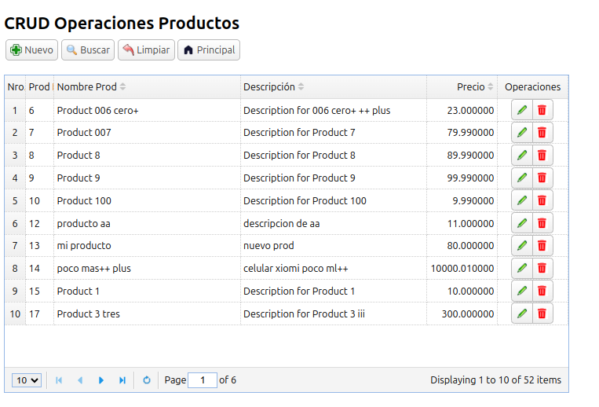

# La Aplicación CRUD de Productos definitiva  - **ProductHUBre** -
## Funcionalidades: Creación, recuperación, modificación, filtrado y eliminación de productos



## Descripción general

Este proyecto implementa una aplicación CRUD (Crear, Leer, Actualizar, Eliminar) integral para gestionar productos, construida utilizando React, EasyUI y una API REST. La aplicación ofrece características como filtrado, paginación y personalización de columnas dentro de una interfaz de cuadrícula fácil de usar.

- **Operaciones CRUD Completas:** Crear, leer, actualizar y eliminar productos de la API .
- **Filtrado Avanzado:** Filtrar datos según múltiples criterios.
- **Cuadrícula Personalizable:** Ajustar los anchos de las columnas según tus preferencias.
- **Paginación:** Navegar fácilmente a través de grandes conjuntos de datos.
- **Integración de API REST:** Consume una API REST para la gestión de datos (sin conexión directa a la base de datos).

## Demo en vivo:

Accede a al sitio de demostración en vivo en: ****

## Stack técnico

**Frontend:** React, EasyUI

**Backend:** API REST (basada en JSON) https://product-api-smoky.vercel.app/

## Infraestructura:
OS: Ubuntu 20.04.6 LTS o 24.04.4 LTS, Windows 10 Pro 1803

**Node.js:** v20.15.0

**npm/npx:** 10.8.1

**React:** 18.3.1

**EasyUI:** 1.10.19

## Instalacion
  
1. Crear una aplicación React:

```bash
    npm install -g create-react-app

    npm i axios

    create-react-app my-app

    cd my-app
 ```

2. Instalar EasyUI para React.

```bash
    npm install rc-easyui --save
 ```

3. Importar CSS.

```react

    @import '~rc-easyui/dist/themes/default/easyui.css';

    @import '~rc-easyui/dist/themes/icon.css';

    @import '~rc-easyui/dist/themes/react.css';
```

4. Usar componentes de EasyUI:

```react
    import { DataGrid, GridColumn } from 'rc-easyui';
```

5. Ejecutar la aplicación:

```bash
    npm start
```

Notas adicionales:

- La captura de pantalla corera.png proporciona una representación visual de la interfaz de la aplicación.

- La API REST se utiliza para obtener y manipular datos de productos sin una conexión directa a la base de datos.

- El componente de cuadrícula ofrece características como filtrado, paginación y redimensionamiento de columnas para mejorar la experiencia del usuario.

- La biblioteca rc-easyui se utiliza para construir la interfaz de cuadrícula interactiva para los datos de productos. Para más detalles sobre esta biblioteca, puedes consultar la documentación oficial: https://www.jeasyui.com/download/rc.p

### Comandos útiles:

Información del sistema:

```Bash

lsb_release -a && uname -r

node -v && nvm -v && npm -v && npx -v
```

(C) 2024 Favian Medina Gemio

 